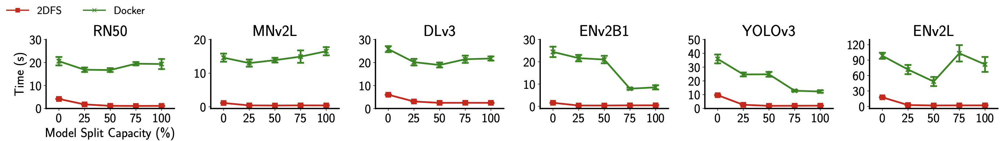

This repository is to be intended for the sole purpose of evaluating the artifacts presented in the ATC 2025 Paper entitled: **On-Demand Container Partitioning for Distributed ML** 

- The 2DFS-builder and CLI implementation is available at: [https://github.com/2DFS/2dfs-builder](https://github.com/2DFS/2dfs-builder)
- The 2DFS-registry implementation is available at: [https://github.com/2DFS/2dfs-registry](https://github.com/2DFS/2dfs-registry)

Each tool comes with instructions on how to install and use it. The `2DFS-builder` is a CLI tool that allows you to build OCI images using the 2DFS technology, while the `2DFS-registry` is a container registry, based on the OCI distribution spec, that allows you to store and manage your OCI images compliant with the 2DFS technology.

### Disclaimer
The code is not intended for production use and is not supported. In no event shall the authors or copyright holders be liable for any claim, damages, or other liability, whether in an action of contract, tort, or otherwise, arising from, out of, or in connection with the code or the use or other dealings in the code.

# How to reproduce the paper results

## Requirements
- Ubuntu 22.04 or newer. This code has been tested on Ubuntu 22.04. 
- Docker installation (please follow [this guide](https://docs.docker.com/engine/install/) )
- Rootless Docker installation. This is required to run the evaluation scripts without `sudo`. To do this, you need to add your user to the `docker` group. Please refer to the following [Docker Rootless documentation](https://docs.docker.com/engine/install/linux-postinstall/).
- Python 3.8 or higher installed. You can check your Python version by running:
 ```bash
    python3 --version
 ```
- Install `ifstat`. You can do this by running:
 ```bash
     sudo apt-get install ifstat 
 ```

## Overview

**Q:** How to evaluate the 2DFS artifacts presented in the ATC 2025 Paper?  <br>
**A:** The evaluation is based on the following steps:

1. **Setup the environment**: Setup the environment of the machine where you want to run the evaluation scripts be following the steps below:
    - (1.1) Install the latest `tdfs`CLI utility: 
 ```bash
        curl -sfL 2dfs.github.io/install-tdfs.sh | sh - 
 ```
    - (1.2) Clone this repository and navigate its root directory:
 ```bash
        git clone https://github.com/2DFS/artifacts-evaluation ATC25-2dfs-artifacts-evaluation && cd ATC25-2dfs-artifacts-evaluation
 ```
    - (1.3) Download and extract the evaluation dataset:
 ```bash
        curl -L https://github.com/2DFS/artifacts-evaluation/releases/download/models/splits.tar.gz -o splits.tar.gz
        tar -xvf splits.tar.gz
        rm -rf splits.tar.gz
 ```
    - (1.4) Install the required Python packages:
 ```bash
        pip3 install -r requirements.txt
 ```


2. **Run the evaluation scripts**: For each of the figures in our paper, we include a script to run its evaluation. The scripts assume that both docker and `tdfs` are installed and the `splits/` folder containing the models and splits is in the same directory as the evaluation scripts, so **make sure you completed the step above**. The scripts to reproduce each figure are available [below](#evaluation-scripts).

3. **Get the results**: The results of each experiment will be saved in the current directory both as `.csv` files and as `.pdf`, reproducing the results and pictures of the paper. The files use the common filename structure `results_fig<fig-number>.csv` and `fig<fig-number>_reproduced.pdf`. For example, the results of Figure 8 will be saved in `results_fig8.csv`, and the plot will be saved in `fig8_reproduced.pdf`. 
The results might slightly differ in scale from the values of the paper due to different machine configurations and environments. For example, faster Read/Write speed on the disk compared to the machines used in the evaluation of the paper will lead to faster build times. 

## Evaluation Scripts 

These artifact evaluation scripts reproduce all the results presented in the Evaluation section of the paper, specifically from Fig.8 to Fig. 14. 

>N.b. To reduce the time overhead of this evaluation, **by default** each experiment is executed only once. Suppose you're willing to repeat each experiment multiple times to increase its accuracy. In that case, it is possible to export the `EXPERIMENT_REPEAT` environment variable to the number of times you want to repeat each experiment. For example, to repeat each experiment 2 times, run:
>```bash
>export EXPERIMENT_REPEAT=2
>```

### Figure 8: Build time for a single image with increasing number of splits per layer.

- **Script setup time:** <1 minute
- **Script execution time:** ~10 minutes
    


- To run the evaluation for Figure 8, run the following command:
```bash
   python3 fig8.py
```
#### Expected behavior:
During the experiment, for each experiment configuration, the script will print messages like the following:
```bash
###TDFS EXPERIMENT##
Total time:  5.92 Download time 4.336642265319824 Layering time 0.3461027145385742
###DOCKER EXPERIMENT##
Total time:  12.2 Download time 1.4 Layering time 7.099999999999991
```
They highlight the total build time, download time (from Dockerub), and container layering time for each experiment configuration. These results already give the user an idea of the performance of TDFS vs Docker. 
N.b.: the download time is not considered in the final results of the paper as it is considered not relevant, but it is included in the output for completeness.

#### Results:
At the end of the execution, the script will save the results in a file called `results_fig8.csv` in the current directory. The script will also generate a plot of the results and save it in a file called `fig8_reproduced.pdf` in the current directory. The plot will be saved in the same format as the one presented in the paper.

### Figure 9: Build time for different split partitions where each partition is packaged as a separate image.

- **Script setup time:** <1 minute
- **Script execution time:** ~15 minutes


- To run the evaluation for Figure 9, run the following command:
```bash
   python3 fig9.py
```
#### Expected behavior:
During the experiment, for each experiment configuration, the script will print messages like the following:
```bash
###TDFS EXPERIMENT##
Total time:  5.92 Download time 4.336642265319824 Layering time 0.3461027145385742
###DOCKER EXPERIMENT##
Total time:  12.2 Download time 1.4 Layering time 7.099999999999991
```
They highlightg the Total build time, download time (from Dockerub,) and container layering time for each experiment configuration. These results already give the user an idea of the performance of TDFS vs Docker. 
N.b.: the download time is not considered in the final results of the paper as it is considered not relevant, but it is included in the output for completeness.

#### Results:
At the end of the execution, the script will save the results in a file called `results_fig9.csv` in the current directory. The script will also generate a plot of the results and save it in a file called `fig9_reproduced.pdf` in the current directory.

### Figure 10: Resources consumption during image build.

- **Script setup time:** <1 minute
- **Script execution time:** ~5 minutes


- To run the evaluation for Figure 10, run the following command:
```bash
   python3 fig10.py
```
#### Expected behavior:
During the experiment, for each experiment configuration, the script will print messages like the following:
```bash
###TDFS EXPERIMENT##
Total time:  5.92 Download time 4.336642265319824 Layering time 0.3461027145385742
###DOCKER EXPERIMENT##
Total time:  12.2 Download time 1.4 Layering time 7.099999999999991
```
They highlight the Total build time, download time (from Dockerub), and container layering time for each experiment configuration. These results already give the user an idea of the performance of TDFS vs Docker. 
N.b.: the download time is not considered in the final results of the paper as it is considered not relevant, but it is included in the output for completeness.

#### Results:
At the end of the execution, the script will save the results in a file called `results_fig10.csv` and `cpumemoryusage.csv` in the current directory. The former contains the build output, like in Figs 8 and 9, while the latter contains the CPU and memory consumption measurements during the experiments. The script will also generate a plot of the results and save it in a file called `fig10_reproduced.pdf` in the current directory. 

**Disclaimer:** CPU and memory measurements fluctuate based on machine usage in real-time. Please consider this when interpreting the results. Additionally, due to high fluctuations, the standard deviation of the measurements can be high; this effect is mitigated by running the experiment multiple times.

### Figures 11, 12, and 13: Download of partitioned vs prebuilt images.

- **Script setup time:** ~5 minutes
- **Script execution time:** ~10 minutes


Figures 11, 12, and 13 are generated together as part of the same experiment. 
To run the evaluation for Figures 11, 12, and 13, follow these steps:

- First, authorize the `2DFS+OCI` compliant registry to run locally. This is required to run the evaluation scripts. Edit the `/etc/docker/daemon.json` file and either replace its content with the following lines or simply add the primitive: 
```json
{
    "insecure-registries" : ["0.0.0.0:10500"]
}
```
- Then restart the Docker daemon by running:
```bash
    sudo systemctl restart docker
```
- Now you can run the 2DFS+OCI compliant registry locally using: 
```bash
docker run -d -p 10500:5000 --restart=always --name 2dfs-registry ghcr.io/2dfs/2dfs-registry:edge
```
- Then run the evaluation script:
```bash
    python3 fig11-13.py
```
- After the experiment is finished, you can shut down the registry by running the following:
```bash
    docker stop 2dfs-registry
```

#### Expected behavior:
The script should run multiple Docker and TDFS builds, each one with a different configuration. At the end of each build, it pushes the artifacts to the local registry. Then, it performs different pulls for each image partition. 

#### Results:
At the end of the execution, the script will save the results in files called `results_fig11.csv`, `cpumemoryusage.csv`, and `bandwidth-result.log` in the current directory. The first contains the build output results, the second contains the CPU and Memory consumption measurements during the experiments, and the third contains the bandwidth measurements at the docker bridge. The script will also generate the plots of the results and save them respectively in the files:  `fig11_reproduced.pdf`,`fig12_reproduced.pdf`, and `fig13_reproduced.pdf` in the current directory.

**Disclaimer:** CPU, memory, and bandwidth measurements fluctuate based on machine usage in real-time. In this script, the registry runs locally with the builder. So, expect additional background noise compared to the paper. Please consider this when interpreting the results. Additionally, due to high fluctuations, the standard deviation of the measurements can be high; this effect is mitigated by running the experiment multiple times.

### Figure 14: Build time after model updates with image caching.

- **Script setup time:** <1 minute
- **Script execution time:** ~10 minutes


- To run the evaluation for Figure 14a and Figure 14b, run the following command:
```bash
   python3 fig14.py
```
#### Expected behavior:
During the experiment, the script initially runs a TDFS build and a Docker build for the base images. Then, the script will perform the layer updates according to the experiment configuration and re-perform the build with the new layers. The script will print messages like the following:
```bash
Change allotments...
###TDFS EXPERIMENT##
Total time:  5.59 Download time 0.3019580841064453 Layering time 2.4875688552856445
###DOCKER EXPERIMENT##
Total time:  84.81 Download time 12.299999999999983 Layering time 15.29999999999998
```
They highlight the Total build time, download time (from Dockerub), and container layering time for each experiment configuration. These results already give the user an idea of the performance of TDFS vs Docker. 
N.b.: the download time is not considered in the final results of the paper as it is considered not relevant, but it is included in the output for completeness.

#### Results:
At the end of the execution, the script will save the results in a file called `results_fig14.csv` in the current directory. This file contains the execution results. The script will also generate a plot of the results and save them respectively in `fig14_a_reproduced.pdf` and `fig14_b_reproduced.pdf` in the current directory. 